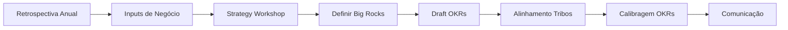

# 🎯 Planejamento Anual (Janeiro)

> [!abstract] Objetivo
> Definir **visão, estratégia, Big Rocks e OKRs anuais** que orientam todas as tribos por 12 meses.

Voltar para [[Processo de Produto]]

---

## Participantes

| Papel | Responsabilidade |
|-------|-----------------|
| Head de Produto | Facilita, define visão e estratégia, aprova Big Rocks |
| PMs das Tribos | Propõem Big Rocks dos seus domínios, definem OKRs de tribo |
| Líderes de Engenharia | Viabilidade técnica, capacidade, dívida técnica |
| Design Leads | Visão de experiência, research pendente |
| Stakeholders de Negócio | Contexto de mercado, metas de negócio, restrições |

---

## Cadência (3-4 semanas em Janeiro)

### Semana 1 — Inputs & Contexto
- Retrospectiva do ano anterior (métricas, aprendizados)
- Inputs de negócio (revenue targets, mercado, competição)
- Research consolidado (discovery acumulado)

### Semana 2 — Strategy Workshop
- Diagnóstico: Qual é o problema central?
- Política orientadora: Onde vamos focar e o que NÃO faremos
- Big Rocks: 3-5 apostas estratégicas para o ano
- Draft de OKRs anuais

### Semana 3 — Alinhamento entre Tribos
- Cada PM apresenta como Big Rocks se traduzem na tribo
- Identificação de dependências cross-tribo
- Calibragem de OKRs (evitar overlap, garantir cobertura)

### Semana 4 — Finalização & Comunicação
- Documento de Estratégia finalizado
- OKRs aprovados
- Comunicação para toda a organização

---

## Artefatos Produzidos

| Artefato | Template | Onde Vive |
|----------|---------|-----------|
| Visão de Produto (12 meses) | Documento narrativo (From → To) | Confluence |
| Estratégia de Produto | [[Template - Estratégia de Produto]] | Confluence |
| Big Rocks (3-5) | [[Template - Big Rock]] | **Jira Product Discovery** |
| OKRs Anuais | Objetivos + Key Results | Confluence + Jira (labels) |
| Mapa de Dependências | Diagrama visual | Miro |

---

## Fluxo do Planejamento

> [!warning] Atenção
> O planejamento anual **não é uma lista de features**. É sobre **outcomes e apostas estratégicas**. Features serão definidas trimestralmente pelas tribos.

---

## Checklist de Qualidade

- [ ] Diagnóstico é específico e baseado em evidência
- [ ] Política orientadora restringe foco (diz o que NÃO fazer)
- [ ] Big Rocks são apostas com outcomes mensuráveis
- [ ] OKRs são ambiciosos mas atingíveis (stretch goals)
- [ ] Todas as tribos entendem como contribuem
- [ ] Dependências cross-tribo estão mapeadas
- [ ] Comunicação feita para toda a organização

---

Ver também: [[2- Revisão Semestral]] · [[3- Ciclo Trimestral]] · [[6- Governança RACI]]
