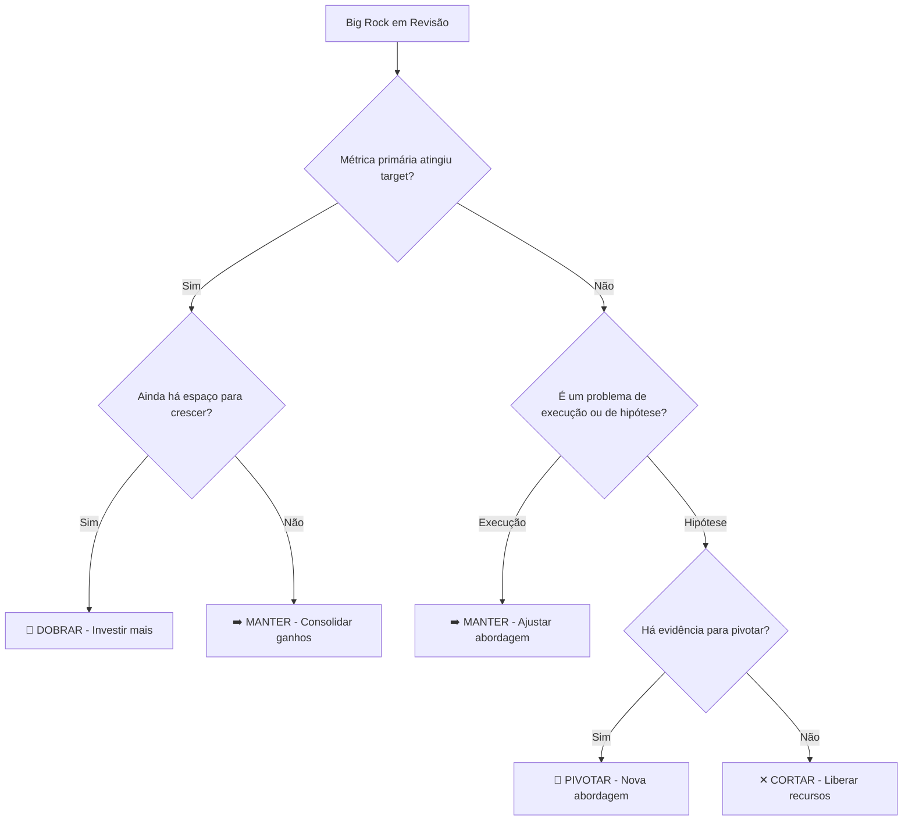

# 🔄 Revisão Semestral (Julho)

> [!abstract] Objetivo
> Avaliar progresso das Big Rocks, ajustar estratégia com base em aprendizados, e recalibrar OKRs para o segundo semestre.

Voltar para [[Processo de Produto]]

---

> [!important] Ponto-chave
> A revisão semestral **NÃO é um novo planejamento**. É um checkpoint de **ajuste de rota** — manter o que funciona, pivotar o que não funciona, e adicionar novas apostas apenas se houver evidência forte.

---

## Cadência (1-2 semanas em Julho)

### Semana 1 — Avaliação de Resultados
- Cada PM apresenta: métricas vs targets das Big Rocks
- Feature Usage Audit (o que foi adotado vs ignorado)
- Learnings consolidados de Discovery
- Usa [[Template - Revisão de Big Rock]] para cada Big Rock

### Semana 2 — Ajustes Estratégicos
- Decisão por Big Rock: **Dobrar ↑ | Manter → | Pivotar ↻ | Cortar ✕**
- Recalibração de OKRs para S2
- Ajuste de alocação de recursos entre tribos
- Comunicação de mudanças

---

## Decisões sobre Big Rocks

---

## Artefatos Atualizados

- Estratégia de Produto **v2** (ajustada)
- Big Rocks (atualizadas com status e ajustes)
- OKRs S2 (recalibrados)
- Comunicação para organização

---

## Checklist

- [ ] Todas as Big Rocks foram avaliadas com dados
- [ ] Decisão documentada para cada Big Rock (Dobrar/Manter/Pivotar/Cortar)
- [ ] OKRs S2 definidos e calibrados
- [ ] Alocação de recursos revisada entre tribos
- [ ] Mudanças comunicadas para a organização
- [ ] Learnings documentados

---

Ver também: [[1- Planejamento Anual]] · [[3- Ciclo Trimestral]] · [[Template - Revisão de Big Rock]]
