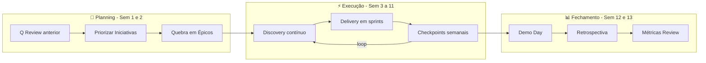

# 📦 Ciclo Trimestral de Iniciativas

> [!abstract] Objetivo
> Traduzir as Big Rocks em iniciativas priorizadas, quebrá-las em épicos e executar com Discovery contínuo + Delivery iterativo.

Voltar para [[Processo de Produto]]

---

## Visão do Trimestre (13 semanas)



---

## Fase 1 — Quarter Planning (Semanas 1-2)

### Cerimônias

| Cerimônia | Duração | Participantes | Template |
|-----------|---------|--------------|----------|
| Q Review (retro do Q anterior) | 2h | Head + todos PMs | [[Template - Quarterly Review]] |
| Quarterly Planning por Tribo | 4h cada | PM + Tech Lead + Design | [[Template - Quarterly Planning]] |
| Cross-Tribe Alignment | 2h | Head + PMs + Tech Leads | — |
| OKR Setting Trimestral | 2h | Head + PMs | — |

### Processo de Priorização

> [!tip] Fluxo no Jira Product Discovery
> 1. Cada PM traz ideias conectadas às Big Rocks
> 2. Scoring com Impact, Reach, Confidence, Effort
> 3. Filtrar pela capacidade do time no Q
> 4. Selecionar **3-5 iniciativas por tribo**
> 5. Promover ideias validadas → Épicos no Jira Software

```
BIG ROCKS (Anuais)
       │
       ▼
┌─────────────────┐
│ FILTRO           │
│ ESTRATÉGICO      │  Conecta com Big Rock ou OKR?
└────────┬────────┘
    Sim  │  Não → Backlog / Descarte
         ▼
┌─────────────────┐
│ JIRA PRODUCT     │
│ DISCOVERY        │  Impact · Confidence · Effort · Reach
└────────┬────────┘
         ▼
┌─────────────────┐
│ CAPACITY         │
│ CHECK            │  Cabe na capacidade do time no Q?
└────────┬────────┘
         ▼
┌─────────────────┐
│ INICIATIVAS      │
│ DO Q (3-5)       │  Usar [[Template - Iniciativa Trimestral]]
└─────────────────┘
```

### Regras de Ouro

> [!warning] Limites que protegem o foco
> - Máximo **3-5 iniciativas por tribo por trimestre**
> - Toda iniciativa deve ter **Kill Criteria** definidos antes de começar
> - Reserve **20% da capacidade** para tech debt + urgências
> - Cada iniciativa deve caber em **1 trimestre** — se não cabe, quebre

---

## Fase 2 — Execução (Semanas 3-11)

### Dual-Track: Discovery + Delivery

```
PM + Design ──── Discovery Track ──────────────────
                 • Entrevistas com usuários
                 • Protótipos e testes
                 • Validação de hipóteses
                 • Refinamento de histórias
                      │
                      │ Ideias validadas
                      ▼
Engenharia ──── Delivery Track ────────────────────
                 • Sprints / Ciclos
                 • Reviews
                 • Entregas incrementais
                 • Monitoramento de métricas
```

> [!note] Discovery não para
> O Discovery acontece **em paralelo** à Delivery. Enquanto os devs constroem o que foi validado, PM e Design estão validando o que vem a seguir.

### Da Iniciativa ao Épico

Hierarquia de trabalho:

| Nível | Escopo | Template |
|-------|--------|----------|
| 🏔️ Big Rock | Anual — aposta estratégica | [[Template - Big Rock]] |
| 📦 Iniciativa | Trimestral — outcome mensurável | [[Template - Iniciativa Trimestral]] |
| 📋 Épico | 4-6 semanas — entrega independente | [[Template - Épico]] |
| 📝 User Story | Sprint — fatia vertical de valor | — |
| 🔧 Sub-task | Dias — tarefa técnica | — |

> [!warning] Épicos saudáveis
> - Nunca dura mais que **6 semanas** — se durar, quebre
> - Deve ser **entregável independentemente** (gerar valor sozinho)
> - User Stories devem ser **verticais** (end-to-end), não horizontais
> - Todo Épico tem **Definition of Done** clara documentada no Jira

---

## Fase 3 — Fechamento do Quarter (Semanas 12-13)

| Cerimônia | Duração | Participantes | Template |
|-----------|---------|--------------|----------|
| Demo Day (all-hands) | 2h | Todas as tribos | [[Template - Demo Day]] |
| Q Retrospectiva | 2h por tribo | PM + Squad | — |
| Metrics Closing | 1h | PMs + Analytics | — |
| Portfolio Review | 2h | Head + PMs | [[Template - Quarterly Review]] |

---

Ver também: [[1- Planejamento Anual]] · [[4- Execução Semanal]] · [[6- Governança RACI]]
