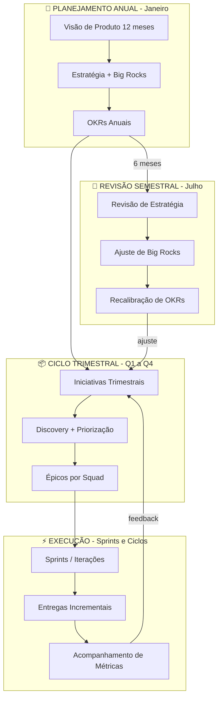

# 🎯 Processo de Produto v2 — Do Estratégico ao Tático (Topologia em 4 Pilares)

> [!abstract] Resumo
> Framework de gestão de produto com ciclos trimestrais, planejamento anual, revisões semestrais, e execução por squads. Organizado através da topologia de **Quatro Pilares** sob a Liderança executiva, com o papel gerencial de GPM (Group Product Manager) definindo a quebra estratégica, e PMs executando a tática por escopo.

---

## 👥 Topologia de Times (Quatro Pilares)

A organização técnica de Produto MGC está estruturada através da topologia de pilares, focando em jornadas com sustentação de escopos especialistas:
1. **Fundação / IaaS**: Serviços de núcleo e infraestrutura: VM, Storage, Network, Load Balancer e IAM.
2. **PaaS / DevX & AI**: Plataforma e developer experience: orquestração corporativa (K8s), DBaaS, CLI/SDK, Magma, Movestax e AI/Inference.
3. **Customer Products**: Produtos voltados ao cliente: Console/Aquisição, onboarding, experiência corporativa (B2B) e site.
4. **Commerce / O2C**: Esteira comercial e financeira: Billing, Metering e Order-to-Cash.

*Governança de Topologia:* Mapeamentos de skills e allocs de PD/PM (como apontados nos gaps de maturidade e vagas) são contínuos. O GPM atua no intermédio entre o direcional anual e a priorização do Squad.

---

## Ciclo Completo



---

## 📚 Navegação do Processo

### Processo (como funciona)

| Fase | Nota | Quando |
|------|------|--------|
| 🎯 Estratégico | [[1- Planejamento Anual v2]] | Janeiro |
| 🔄 Revisão | [[2- Revisão Semestral v2]] | Julho |
| 📦 Trimestral | [[3- Ciclo Trimestral]] | Q1-Q4 |
| ⚡ Execução | [[4- Execução Semanal]] | Toda semana |
| 👥 Governança | [[6- Governança RACI v2]] | Referência |
| 📊 Métricas | [[5- Métricas e Acompanhamento]] | Referência |

### Templates (copiar e preencher)

| Template | Uso |
|----------|-----|
| [[Template - Estratégia de Produto]] | Planejamento Anual |
| [[Template - Big Rock]] | Definir aposta estratégica |
| [[Template - Iniciativa Trimestral]] | Planejar iniciativa do Q |
| [[Template - Épico]] | Quebra tática para squads |
| [[Template - Weekly dos PMs]] | Pauta da weekly semanal |
| [[Template - Quarterly Planning]] | Pauta do planning do Q |
| [[Template - Demo Day]] | Pauta do Demo Day |
| [[Template - Revisão de Big Rock]] | Avaliar Big Rock no semestral |
| [[Template - Quarterly Review]] | Revisão trimestral de produto |

### Dashboards (visão dinâmica)

| Base | O que mostra |
|------|-------------|
| [[Big Rocks Tracker]] | Status das Big Rocks anuais |
| [[Iniciativas Tracker]] | Iniciativas do quarter atual |
| [[OKRs Tracker]] | Progresso dos OKRs |

### Pastas de Conteúdo

- 📂 `Big Rocks/` — Uma nota por Big Rock
- 📂 `Iniciativas/` — Uma nota por Iniciativa trimestral
- 📂 `OKRs/` — Uma nota por conjunto de OKRs

---

## 📅 Calendário Anual

```
JAN ── PLANEJAMENTO ANUAL ──────────────────────
│  Visão + Estratégia + Big Rocks + OKRs

FEV ── Q1 PLANNING + EXECUÇÃO ──────────────────
MAR ── Q1 EXECUÇÃO ─────────────────────────────

ABR ── Q1 CLOSE + Q2 PLANNING ──────────────────
MAI ── Q2 EXECUÇÃO ─────────────────────────────
JUN ── Q2 EXECUÇÃO ─────────────────────────────

JUL ── Q2 CLOSE + REVISÃO SEMESTRAL + Q3 ───────
AGO ── Q3 EXECUÇÃO ─────────────────────────────
SET ── Q3 EXECUÇÃO ─────────────────────────────

OUT ── Q3 CLOSE + Q4 PLANNING ──────────────────
NOV ── Q4 EXECUÇÃO ─────────────────────────────
DEZ ── Q4 CLOSE + PREP ANUAL ───────────────────
```

---

## ⚡ Resumo em Uma Página

> [!tip] O Processo em 30 Segundos
> - **Anual**: Visão → Estratégia → Big Rocks (3-5 apostas) → OKRs + Definição/Ajuste de Topologia
> - **Semestral**: Avaliar Big Rocks → Dobrar/Pivotar/Cortar → Recalibrar → Revisar Topologia/Headcount
> - **Trimestral**: Priorizar iniciativas → Quebrar em épicos → Executar
> - **Semanal**: Weekly PMs → 1:1s → Discovery → Metrics review
> - **Ferramentas**: JPD (Discovery) → Jira (Delivery) → Confluence (Docs)
> - **Governança**: Head de Produto e GPMs direcionam estratégia; PM tático decide; Squad executa

---

> [!note] Sobre este processo (v2)
> Agnóstico de framework de delivery. Squads podem usar Scrum, Kanban, Shape Up ou qualquer outro. Este processo é a **camada de governança e direcionamento** acima do framework, embasada na divisão em Quatro Pilares do MGC.
